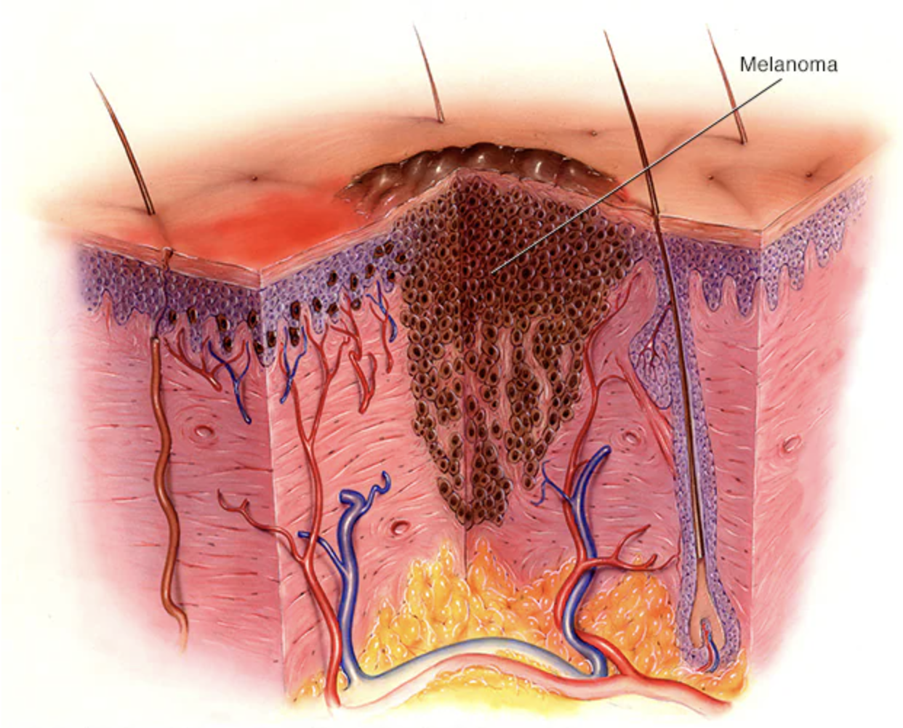
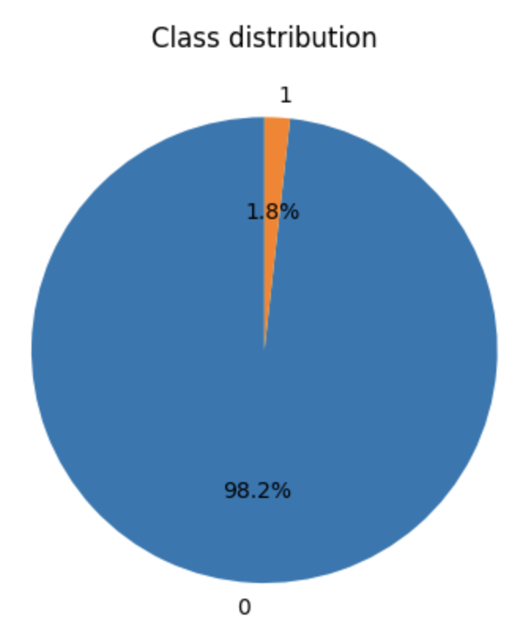
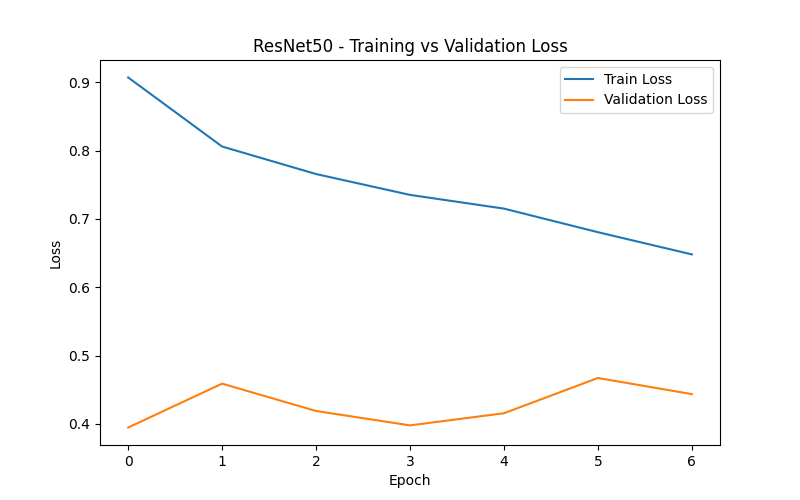
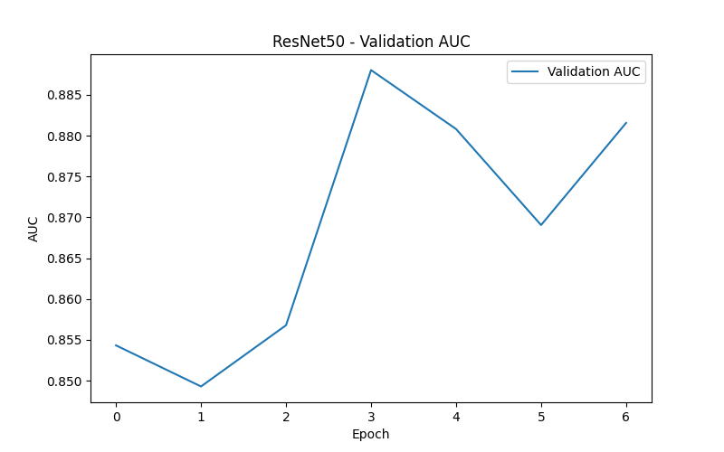
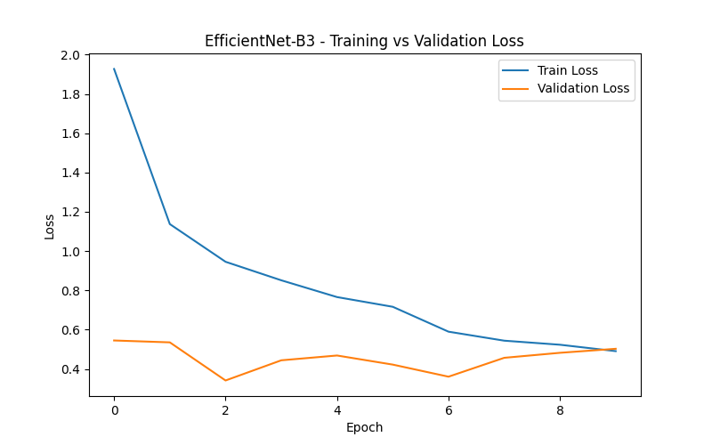
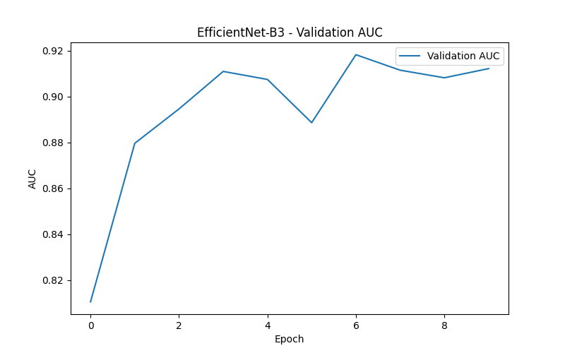

# 🔬 SIIM-ISIC Melanoma Classification

<div align="center">

**Deep Learning pipeline for automated melanoma detection from dermoscopic skin lesion images.**
</div>

**💻 Authors:** Astghik Margaryan · Rafayel Galstyan · Anna Arakelyan

## 🧬 What is Melanoma?

Melanoma is the deadliest form of skin cancer, responsible for 75% of all skin cancer deaths despite being the least common type. It occurs when pigment-making cells in the skin, called melanocytes, begin to reproduce uncontrollably. Melanoma can form from an existing mole or develop on unblemished skin.
<div align="center">

</div>

The most common type of melanoma spreads on the skin's surface. It is called superficial spreading melanoma. It may stay on the surface or grow down into deeper tissues. Other types of melanoma can start anywhere on or inside the body, including under fingernails or toenails and inside the eye.


## 📋 Project Overview

This project tackles the [SIIM-ISIC Melanoma Classification Kaggle Competition](https://www.kaggle.com/competitions/siim-isic-melanoma-classification/overview): given a dermoscopic image of a skin lesion, predict the probability that it is **malignant (melanoma)** or **benign**.


### Dataset

| Property | Details |
|---|---|
| Organizer | SIIM + International Skin Imaging Collaboration (ISIC) |
| Training images | 33,126  |
| Test images | 10,982 |
| Format | JPEG / DICOM |
| Labels | Binary — `0` benign · `1` malignant (melanoma) |
| Patient metadata | Age, sex, anatomical site |
| **Class split** | **~98.2% benign / ~1.8% malignant** |
| Evaluation metric | **ROC-AUC** |


### CSV Columns

| Column | Description | Split |
|---|---|---|
| `image_name` | Unique identifier — filename of the related DICOM image | train + test |
| `patient_id` | Unique patient identifier | train + test |
| `sex` | Sex of the patient *(may be missing)* | train + test |
| `age_approx` | Approximate patient age at time of imaging | train + test |
| `anatom_site_general_challenge` | Anatomical location of the lesion | train + test |
| `diagnosis` | Detailed diagnosis label | train only |
| `benign_malignant` | Indicator of malignancy | train only |
| `target` | Binary target — `0` benign · `1` malignant | train only |


---

## 🏗️ Architecture

Three models were trained and compared, progressing from a simple custom CNN to powerful ImageNet-pretrained networks.

### 1. Baseline CNN

A custom 3-layer Convolutional Neural Network built from scratch.

```
Input (224 × 224 × 3)
         ↓
Conv2d(3→32, k=3)  → BatchNorm2d → ReLU → MaxPool2d(2)
         ↓
Conv2d(32→64, k=3) → BatchNorm2d → ReLU → MaxPool2d(2)
         ↓
Conv2d(64→128, k=3) → BatchNorm2d → ReLU → MaxPool2d(2)
         ↓
AdaptiveAvgPool2d(1×1) → Flatten
         ↓
Linear(128→128) → ReLU → Dropout(0.4)
         ↓
Linear(128→1)   ← raw logit → sigmoid → P(melanoma)
```
**Training config:** 3 epochs · LR 1e-3 · batch 32 · no scheduler · no augmentation

---
---

### 2. Pretrained Models — ResNet50 & EfficientNet-B3 (Fine-tuned)

We used pretrained models initialized on ImageNet, loaded via `timm`. All models were adapted for binary classification by replacing the original classifier head with a single output neuron.

| Model | Architecture |
|---|---|
| ResNet50 | Residual network, 50 layers |
| EfficientNet-B3 ⭐ | Compound-scaled EfficientNet |

**Shared training config:** Up to 10 epochs · LR 1e-4 · batch 32 · `ReduceLROnPlateau` scheduler · full augmentation pipeline · patience 3

---
---

### Training Pipeline

#### Class Imbalance & External Data

The dataset is severely imbalanced — **98.2% benign / 1.8% malignant** — meaning a naive model that always predicts benign would achieve 98% accuracy while completely failing to detect melanoma. Before adding any external data, `pos_weight` (the ratio of negatives to positives) was **56.4**, reflecting how rare melanoma cases are in the original SIIM-ISIC 2020 dataset.

<div align="center">

</div>

To address this, we incorporated the **ISIC 2019 Classification training dataset** as external data. Its columns were aligned to match the structure of our main dataset (keeping `image_name`, `patient_id`, and `target`). After merging the external data into the training set, `pos_weight` dropped to **9.5** — a significant improvement that gives the model a much more balanced learning signal.

#### Data Splitting

The data was split into train and validation folds using **StratifiedKFold** based on `patient_id`. This patient-level split is important to prevent data leakage — since many patients have multiple images, a random image-level split could allow the same patient to appear in both train and validation, causing overly optimistic results. Stratification ensures each fold has a representative proportion of positive patients (a patient is considered positive if any of their images is a melanoma).

**5-Fold Stratified Cross-Validation** is set up on the original SIIM-ISIC data, though only 1 fold is run per model by default (`n_folds=1`). The external ISIC 2019 data is merged **only into the training portion** of each fold — never into validation — to keep the evaluation clean.

#### Augmentation Pipeline

The Baseline CNN uses only normalization. ResNet50 and EfficientNet-B3 use a richer augmentation strategy to help the model generalize to the natural variability in dermoscopic images:

| Augmentation | Probability | Purpose |
|---|---|---|
| Horizontal flip | 0.5 | Orientation invariance |
| Vertical flip | 0.5 | Orientation invariance |
| Random rotate 90° | 0.5 | Rotation invariance |
| Affine (translate ±5%, scale 90–110%, rotate ±20°) | 0.5 | Spatial robustness |
| Random brightness/contrast (±15%) | 0.4 | Lighting variation |
| Blur (Gaussian / Motion / Median) | 0.15 | Sharpness robustness |
| CoarseDropout (1–6 patches, 8–20px) | 0.20 | Occlusion robustness |
| ImageNet normalization | always | Required for pretrained backbone |


#### Dataset & DataLoader

After splitting and augmentation setup, `MelanomaDataset` and `DataLoader` instances are built for both train and validation. The training loader shuffles data each epoch; the validation loader does not.

#### Threshold Tuning

After training, the best probability threshold for converting model outputs into binary predictions is chosen by maximizing the **F2 score**. F2 is used instead of F1 because in a medical screening context **recall matters more than precision** — missing a melanoma is far more dangerous than a false alarm — but precision is still factored in to avoid an impractically high false positive rate.

$$F_2 = \frac{5 \cdot \text{precision} \cdot \text{recall}}{4 \cdot (\text{precision} + \text{recall})}$$

#### Training Details

Each model is trained using **`BCEWithLogitsLoss`** with the computed `pos_weight` to penalize missed melanomas proportionally to their rarity in the dataset. The **Adam optimizer** is used for its adaptive learning rate, which handles the sparse gradient updates that come with heavily imbalanced data. **Gradient clipping** (`max_norm=1.0`) is applied to prevent exploding gradients and keep training stable. For the pretrained models, a **`ReduceLROnPlateau` scheduler** monitors validation AUC and reduces the learning rate when improvement stalls, allowing the model to fine-tune more carefully in later epochs.

The best model checkpoint (by validation AUC) is saved during training and reloaded at the end for threshold tuning. After all models are trained, their mean AUC scores are compared and the **best single model** is selected automatically.


---


## 📊 Results

All models were evaluated on the held-out validation fold (Fold 0) using **ROC-AUC** as the primary metric.

| Model | Epochs Run | Best Val AUC | Best Threshold (F2) | Best F2 |
|---|---|---|---|---|
| Baseline CNN | 3 | 0.8125 | 0.25 | 0.2032 |
| ResNet50 | 7 (early stop) | 0.8880 | 0.30 | 0.3037 |
| **EfficientNet-B3** ⭐ | **10 (early stop)** | **0.9183** | **0.25** | **0.4263** |

**Improvement over Baseline CNN:**
- ResNet50: **+0.0755 AUC**
- EfficientNet-B3: **+0.1058 AUC**

The best single model is **EfficientNet-B3** with a mean AUC of **0.9183** and a best threshold of **0.25**, saved at `models/efficientnet_b3_fold0.pth`.

---

### Training Curves

Training and validation loss curves, along with validation AUC curves, are saved automatically to the `plots/` directory after training:

```
plots/
├── Baseline CNN_loss.png
├── Baseline CNN_auc.png
├── ResNet50_loss.png
├── ResNet50_auc.png
├── EfficientNet-B3_loss.png
└── EfficientNet-B3_auc.png
```

**Baseline CNN — Loss curve:**

<div align="center">

</div>

**Baseline CNN — Validation AUC curve:**

<div align="center">

</div>

**ResNet50 — Loss curve:**

<div align="center">

</div>

**ResNet50 — Validation AUC curve:**

<div align="center">

</div>

**EfficientNet-B3 — Loss curve:**

<div align="center">

</div>

**EfficientNet-B3 — Validation AUC curve:**

<div align="center">

</div>


---
## ⚙️ How to Run

### 1. Clone the repository

```bash
git clone https://github.com/AstxMargaryan/Melanoma-Classification.git
cd Melanoma-Classification
```


### 2. Create virtual environment

**Mac/Linux:**

```bash
python3 -m venv venv
source venv/bin/activate
```

**Windows:**

```bash
python -m venv venv
venv\Scripts\activate
```

###  3. Install dependencies

```bash
pip install -r requirements.txt
```

## 📦 Dataset Setup

The dataset is NOT included in this repository.

### 🖥️ Option 1 — Local Setup

Download the dataset:

📁 [Download Dataset](https://drive.google.com/drive/folders/1y-LUVhRqnVz1XseVpAkFJ3PYm9Uu6-WB)

Extract it into the project root:

```
Melanoma-Classification/
├── dataset/
│   ├── train.csv
│   ├── test.csv
│   ├── sample_submission.csv
│   ├── train/
│   ├── test/
│   ├── jpeg/
│   │   ├── train/           ← original SIIM-ISIC training images
│   │   └── test/            ← original SIIM-ISIC test images
│   │
│   │   ── External ──────────────────────────────
│   ├── train-metadata.csv   ← external dataset labels
│   └── image/               ← external ISIC images
```

Run prediction:

```bash
python3 predict.py <path/to/image.jpg>
```

### ☁️ Option 2 — Google Colab (Recommended — free T4 GPU🚀)


**Step 1 — Mount Google Drive**
```bash
from google.colab import drive
drive.mount('/content/drive')
```
**Step 2 — Prepare dataset**

```bash
# Extract pre-resized images
!unzip "/content/drive/MyDrive/dataset/jpeg_224.zip" -d /content/ -x "__MACOSX/*"

# Extract external images
!unzip "/content/drive/MyDrive/dataset/image.zip" -d /content/ -x "__MACOSX/*"

# Copy CSV files
!cp /content/drive/MyDrive/dataset/train.csv /content/train.csv
!cp /content/drive/MyDrive/dataset/train-metadata.csv /content/train-metadata.csv
```

**Step 3 — Clone the repository**

```bash
!git clone https://github.com/AstxMargaryan/Melanoma-Classification.git
%cd /content/Melanoma-Classification
```
**Step 4 — Install dependencies**

```bash
!pip install -q albumentations==2.0.8 opencv-python-headless
```

**Step 5 — Set dataset path**

```python
import os
os.environ["DATASET_PATH"] = "/content"
```
**Step 6 — Run prediction**
```bash
!python3 predict.py <path/to/image.jpg>
```
